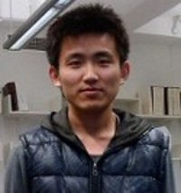



## BIOGRAPHICAL
 
__Xiangzeng ZHOU__, _Ph.D Candidate_ 
• Affiliation: School of Computer Science, Northwestern Polytechnical University 
• Address: No. 127, West Youyi Road, Northwestern Polytechnical University, Xi’an, Shaanxi Province, China, 710072 
• Homepage: [xenuts.github.com](xenuts.github.com)   &nbsp;&nbsp;&nbsp;
• GitHub: [github.com/xenuts](github.com/xenuts)   &nbsp;&nbsp;&nbsp;
• Email: [xenuts@gamil.com](mailto:xenuts@gamil.com)

You may find a print-friendly pdf version from [here](resume.pdf).

## INTERESTS
Object Detection, Object Tracking, Pattern Recognition, Machine Learning

## EDUCATION
• Jul. 2010 - Present    | __Ph.D.__ | _COMPUTER SCIENCE AND TECHNOLOGY_ | Northwestern Polytechnical University 
• Sept. 2006 - Jul. 2010 | __B.S.__ | _COMPUTER SCIENCE AND TECHNOLOGY_ | Northwestern Polytechnical University 

## RESEARCH EXPERIENCE
* [2011.5 - 2011.12] __Towards a Queue-Aware ATM: Monitoring and Managing Queues in front of ATMs__ 
In order to monitoring queues in front of ATMs, apply stereo camera real-time object tracking approach. With the aid of camera’s real-time tracking, develop a simple application system which can give customer a suggested queue and estimated queuing time.

* [2010.9] __Keyword Spotting based Real-time Dialog System__ 
Make a question-set limited Dialog System implemented by Keyword Spotting approach with improved Online Garbage Model. My main task is proposing a improved method based on Online Garbage Keyword Spotting Model.

* [2010.9] __Keyword Spotting Tool__ 
Make a Keyword Spotting Tool which user can dynamically add or remove keywords by hand.

## SKILLs & LANGUAGES
C | Bash | Python | English | Matlab | Emacs | OpenCV | Git | Linux | LaTeX

## HONORS/AWARDS
• 2010 | First Prize Scholarship of Northwestern Polytechnical University 
• 2009 | National Endeavor Scholarship 
• 2009 | First Prize of C Programming Contest of Northwestern Polytechnical University 
• 2009 | First Prize Scholarship of Northwestern Polytechnical University 
• 2008 | National Endeavor Scholarship 
• 2008 | First Prize Scholarship of Northwestern Polytechnical University 
• 2007 | Second Prize of ACM Programming Contest of Northwestern Polytechnical University 
• 2007 | First Prize Scholarship of Northwestern Polytechnical University 
• 2007 | Third Prize of Mathematical Modeling Contest of Northwestern Polytechnical University

## ACTIVITIES
• May 30, 2013 | __Poster Presentation__ on ICASSP 2013 
• Mar., 2012 - Sept., 2012 | __Visiting Researcher__ at University of East Anglia, Norwich, U.K. 
• Apr., 2011 - Oct., 2011 | __Conference Organizing Committee Member__ for APSIPA ASC 2011 
• Nov. 23 - 25, 2010 | __Oral Presentation__ on ICALIP 2010 
• Oct. 26 - 29, 2010 | __Invited Demonstration__ for UIC/ATC 2010

## PUBLICATION

### ❒ 2014
* "An Ensemble of Deep Neural Networks for Object Tracking", 
___Xiangzeng Zhou__, Lei Xie, Peng Zhang and Yanning Zhang_, 
IEEE International Conference on Image Processing (ICIP '14), Oct. 27-30, Paris, Italy. _(submitted)_

* "Tennis Ball Tracking using A Two-Layered Data Association Approach", 
___Xiangzeng Zhou__, Lei Xie, Qiang Huang and Stephen Cox_, 
The IEEE trans. on Multimedia (TMM).
_(submitted)_

* "Unsupervised Broadcast News Story Segmentation Using Distance Dependent Chinese Restaurant Processes", 
_Chao Yang, Lei Xie and __Xiangzeng Zhou___, 
The 39th International Conference on Acoustics, Speech, and Signal Processing (ICASSP '14), May 4-9, 2014, Florence, Italy. 

### ❒ 2013
* "A Two Layered Data Association Approach For Tennis Ball Tracking", 
___Xiangzeng Zhou__, Qiang Huang, Lei Xie, and Stephen J. Cox_, 
The 38th International Conference on Acoustics, Speech, and Signal Processing (ICASSP '13), May 26-31, 2013, Vancouver, Canada.
[[bibtex](publication/Zhou-2013-A.bib)] 
[[pdf](publication/Zhou-2013-A.pdf)]

### ❒ 2012
* "Detection of ball hits in a tennis game using audio and visual information",
_Qiang Huang, Stephen Cox, __Xiangzeng Zhou__, and Lei Xie_,
The Asia-Pacific Signal and Information Processing Association (APSIPA '12), 2012, Xi'an, China.
[[bibtex](publication/Huang-2012-Detection.bib)]
[[pdf](publication/Huang-2012-Detection.pdf)]

### ❒ 2011
* "基于多置信特征融合语音识别拒识算法的设计与实现",
_牛建伟, 谢磊, 路晓明, __周祥增__, 张艳宁_,
第十一届全国人机语音通讯学术会议, 2011, 西安, 中国.

* "Real-time speech-driven virtual avatar",
_Bingfeng Li, __Xiangzeng Zhou___,
The 11st National Conference on Man-Machine Speech Communication (NCMMSC '11), 2011. Xi’an China.

### ❒ 2010
* "Speech and Auditory Interfaces for Ubiquitous, Immersive and Personalized Applications",
_Lei Xie, Wenhuai Zhao, __Xiangzeng Zhou__, Xiaohai Tian, Bingfeng Li, Naicai Sun, Yali Zhao, Yanning Zhang_,
Ubiquitous Intelligence Computing and 7th International Conference on Autonomic Trusted Computing (UIC/ATC), October 26-29, 2010, China.
[[bibtex](publication/Xie-2010-Speech.bib)]
[[pdf](publication/Xie-2010-Speech.pdf)]

